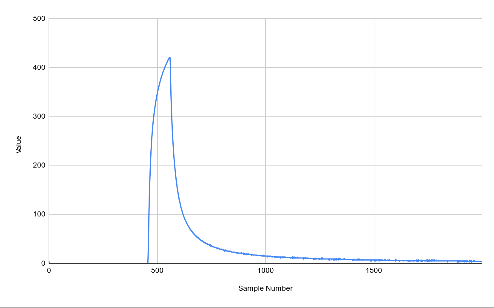
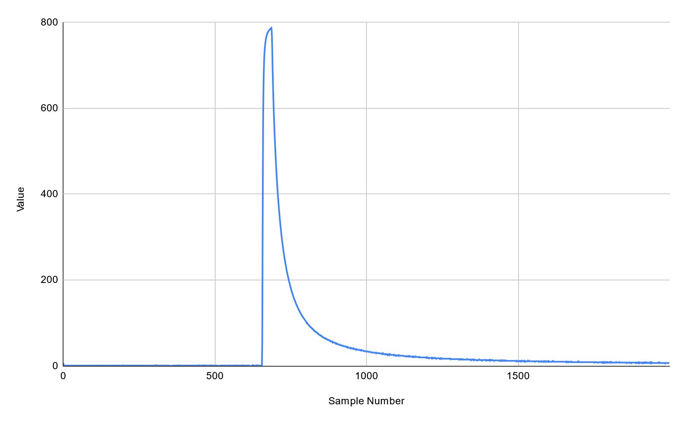

# Camera shutter testing tool

This was an afternoon project to test that the different shutter speeds of my analog camera worked close enough. I don't have an oscilliscope, so I kinda made my own.

The arduino sketch blinks the onboard LED a few times, polls an analog pin at a set sampling rate (0.5 ms), then dumps the contents into the serial monitor as CSV data. I can then paste this into a spreadsheet to look at the results.

# Things I'd maybe improve

- Use a photodiode/phototransistor. I'm using a photoresistor and the slow recovery rate can be seen. One is on the way, because I didn't have any in my parts bin.

- Thresholds for determining when to dump data, and maybe a script running on my machine for dumping to a file.
  - Manual copy/paste from the serial monitor is annoying but not annoying me enough
  - Currently I have this set up to blink an LED twice, record, dump, then halt, as a one-shot. This is restarted by the reset button. I could implement this to record into a circular buffer so that I have less steps, and the buffer could use a smaller sampling rate.

# Example

Using my camera set to 1/15, aperture wide open, and flashlight pointing down the lens with the film back open.

The peak starts at sample 457 and starts to fall off around sample 560 ish. 103 samples at a rate of 0.5 milliseconds is 51.5 milliseconds.

1/15 is 66.6 milliseconds, so the camera is about 77.3% of the way there.

1/60 has a similar result. 688 - 655 = 33 samples = 16.5 ms, which is pretty much correct.

